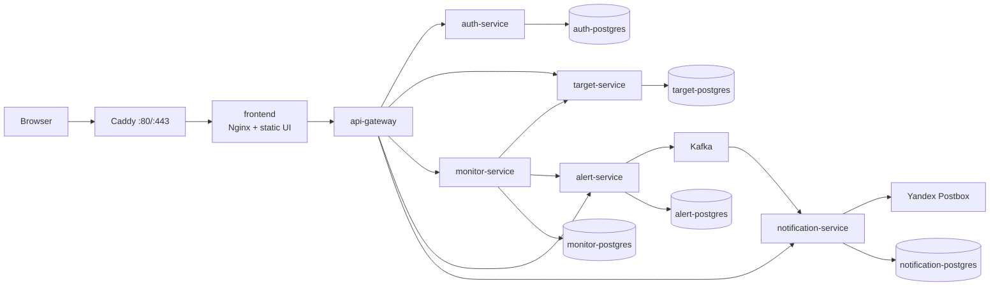
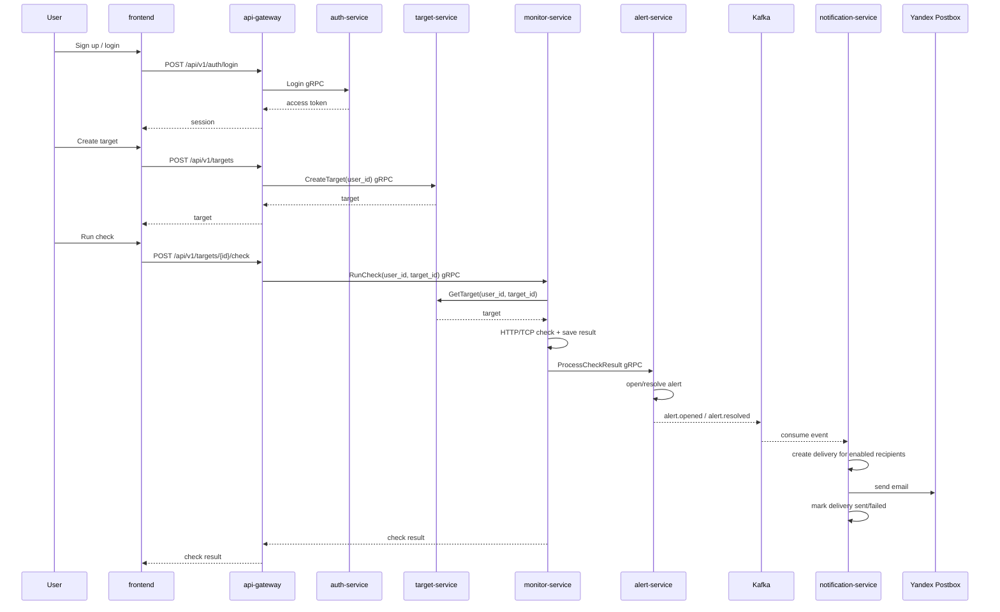

# NetWatch

NetWatch - сервис мониторинга HTTP/TCP targets на C++ и userver. Пользователь
регистрируется, добавляет свои targets, включает уведомления и получает email,
когда target падает или восстанавливается.

Публичный стенд:

- Frontend: `https://netwatch-arsen-demo.online`
- Swagger UI: `https://netwatch-arsen-demo.online/docs`
- OpenAPI JSON: `https://netwatch-arsen-demo.online/openapi.json`

## Стек

- C++ / userver
- gRPC / Protocol Buffers
- Kafka
- PostgreSQL
- Docker / Docker Compose
- Caddy / Nginx
- Vanilla JS frontend
- Yandex Cloud Postbox
- GitHub Actions

## Архитектура



Caddy принимает публичный HTTPS-трафик и отправляет его во `frontend`.
Frontend отдает UI и проксирует `/api`, `/docs`, `/openapi.json`, `/ping` в
`api-gateway`. Внутри системы сервисы общаются по gRPC. Alert events идут через
Kafka в `notification-service`, который отправляет email через Yandex Postbox.

## Как Работает Продукт

1. Пользователь регистрируется или входит во frontend.
2. Пользователь добавляет HTTP/TCP target.
3. `monitor-service` проверяет target вручную или по scheduler.
4. `alert-service` открывает alert, если target упал, и закрывает его после
   восстановления.
5. `notification-service` получает alert event из Kafka и отправляет email
   включенным recipients пользователя.

## Сервисы

| Service | Что делает | Как работает |
| --- | --- | --- |
| `frontend` | UI для пользователей | Static files в Nginx; API calls идут relative paths через proxy в `api-gateway` |
| `api-gateway` | Публичный HTTP API | Проверяет auth token, мапит HTTP/JSON в gRPC calls, отдает Swagger/OpenAPI |
| `auth-service` | Пользователи и сессии | Хранит users/sessions, проверяет email/password, выпускает access token |
| `target-service` | Targets пользователя | Хранит HTTP/TCP targets с `user_id`, валидирует create/update/delete |
| `monitor-service` | Проверки targets | Делает HTTP/TCP checks, сохраняет историю, scheduler берет active targets по lease |
| `alert-service` | Alert lifecycle | Сравнивает previous/current check result, открывает/закрывает alert, пишет outbox event |
| `notification-service` | Email уведомления | Хранит recipients/settings/deliveries, читает Kafka events, отправляет email через Postbox |

У каждого доменного сервиса своя PostgreSQL база и свои migrations. Между
базами нет shared tables; синхронное взаимодействие идет через gRPC, события -
через Kafka.

## Основной Runtime Flow



## Запуск

Локальный compose:

```bash
docker compose up --build
```

После старта:

- Frontend: `http://localhost:3000`
- Swagger UI: `http://localhost:8081/docs`
- Mailpit UI, если включен fake email provider: `http://localhost:8025`

Запуск с доменом и Caddy:

```bash
docker compose -f docker-compose.images.yml -f docker-compose.domain.yml up -d --build
```

Для production-like запуска нужен `.env` рядом с compose-файлом:

```dotenv
NETWATCH_SITE_ADDRESS=netwatch-arsen-demo.online
NOTIFICATION_EMAIL_PROVIDER=yandex-postbox
NOTIFICATION_EMAIL_PROVIDER_URL=https://postbox.cloud.yandex.net
NOTIFICATION_EMAIL_FROM_EMAIL=alerts@netwatch-arsen-demo.online
NOTIFICATION_EMAIL_FROM_NAME=NetWatch
YANDEX_POSTBOX_IAM_TOKEN=
NOTIFICATION_YANDEX_POSTBOX_METADATA_TOKEN_URL=http://169.254.169.254/computeMetadata/v1/instance/service-accounts/default/token
```

Для локального тестирования email без реальной отправки можно явно включить
Mailpit:

```dotenv
NOTIFICATION_EMAIL_PROVIDER=mailpit
NOTIFICATION_EMAIL_PROVIDER_URL=http://mailpit:8025
```

## CI/CD

GitHub Actions собирает сервисы, запускает integration checks, публикует images
в GHCR и может деплоить `deploy/docker-compose.prod.yml` на VPS.

Публикуемые images:

- `frontend`
- `api-gateway`
- `auth-service`
- `target-service`
- `monitor-service`
- `alert-service`
- `notification-service`
