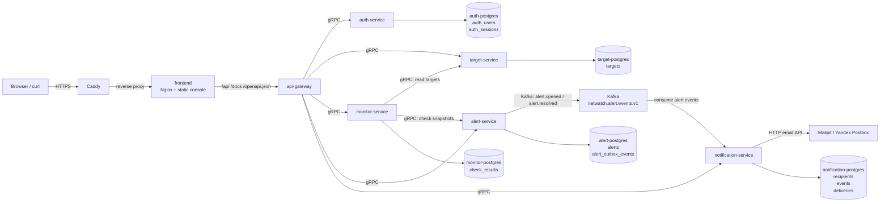
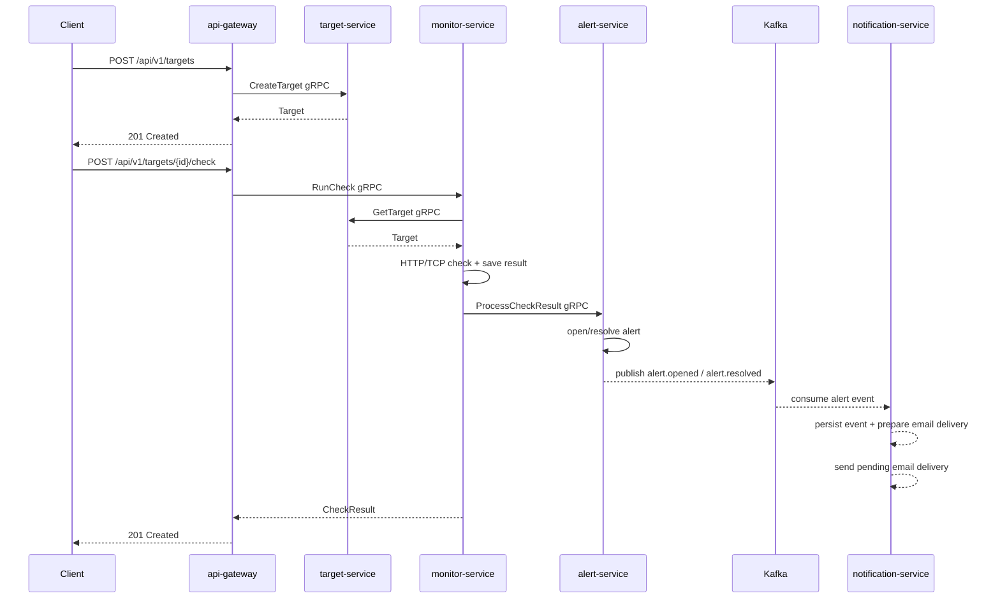

# NetWatch

NetWatch - платформа для мониторинга HTTP/TCP сервисов, написанная на
C++ и userver. Проект построен как микросервисная система: внешний HTTP API
отделен от доменных сервисов, каждый сервис владеет своей базой данных,
а внутреннее взаимодействие идет по gRPC.

Публичный стенд:

- Frontend console: `https://netwatch-arsen-demo.online`
- Swagger UI: `https://netwatch-arsen-demo.online/docs`
- OpenAPI JSON: `https://netwatch-arsen-demo.online/openapi.json`

## Стек

- C++ / userver
- gRPC / Protocol Buffers
- Kafka
- PostgreSQL
- Mailpit
- Yandex Cloud Postbox
- Docker / Docker Compose
- Caddy / Nginx
- Vanilla JS frontend
- CMake / Ninja
- Swagger / OpenAPI
- GitHub Actions

## Что умеет NetWatch

- хранить HTTP и TCP targets
- запускать ручные проверки target через API
- выполнять периодические проверки active targets через scheduler
- сохранять историю check results
- возвращать текущий статус target
- создавать active alert при падении target
- закрывать alert при восстановлении target
- отправлять email-уведомления по alert events через Kafka
- регистрировать пользователей и выпускать access token
- хранить user-scoped targets, recipients и notification deliveries
- включать/выключать email-уведомления для отдельного target
- работать через простой browser frontend
- отдавать Swagger UI и OpenAPI contract
- собираться и проверяться через CI/CD

Gateway нормализует ошибки внутренних gRPC-сервисов в HTTP 502/504, а
`monitor-service` сохраняет результат проверки даже при временной недоступности
`alert-service`. Scheduler использует PostgreSQL lease на target, поэтому
несколько реплик `monitor-service` не запускают одну и ту же scheduled-проверку
одновременно. Основной мониторинг деградирует мягко и не падает целиком из-за
вторичной подсистемы.

## Архитектура



Публичный вход в production-like схеме - Caddy. Он принимает HTTP/HTTPS,
получает TLS certificate через Let's Encrypt и проксирует домен во `frontend`.
Frontend отдает static console и проксирует `/api`, `/docs`, `/openapi.json` и
`/ping` в `api-gateway`. Остальные сервисы считаются внутренними и доступны
друг другу по gRPC внутри runtime-сети. События alert lifecycle доставляются
асинхронно: `alert-service` пишет их в outbox и публикует в Kafka, а
`notification-service` читает topic и отправляет уведомления.

## Сервисы

| Service | Ответственность | Storage |
| --- | --- | --- |
| `frontend` | Static browser console, Nginx proxy для API paths | нет |
| `api-gateway` | HTTP API, Swagger UI, OpenAPI, JSON/gRPC mapping | нет |
| `auth-service` | регистрация, login, sessions/access tokens | `auth_service_db` |
| `target-service` | target domain, CRUD, PATCH, validation | `target_service_db` |
| `monitor-service` | check runner, scheduler, check history, target status | `monitor_service_db` |
| `alert-service` | alert lifecycle, active/resolved alerts, Kafka outbox events | `alert_service_db` |
| `notification-service` | Kafka consumer для alert events, email delivery sender | `notification_service_db` |

### `frontend`

Статический browser frontend. В Docker Compose работает как Nginx container:
отдает `index.html`, `styles.css`, `app.js`, vendored `lucide` icons и
проксирует API paths в `api-gateway`. За счет relative API paths frontend
работает одинаково на `localhost:3000` и на домене через Caddy.

### `api-gateway`

Единая публичная точка входа. Gateway принимает HTTP/JSON, вызывает внутренние
gRPC-сервисы и возвращает клиенту нормальные HTTP-ответы. Он не подключается к
PostgreSQL и не содержит доменных правил.

### `auth-service`

Владелец пользовательской идентичности. Сервис регистрирует пользователей,
проверяет email/password и выпускает access token. `api-gateway` использует
auth gRPC client и scope'ит target/notification операции по `user_id`.

### `target-service`

Владелец target domain. Сервис хранит targets, валидирует HTTP/TCP параметры и
сам применяет PATCH к текущему состоянию target.

### `monitor-service`

Владелец check domain. Сервис получает targets через `target-service`, выполняет
HTTP/TCP проверки, сохраняет историю и возвращает последний статус target.
Scheduler периодически обходит active targets и запускает проверки без участия
внешнего клиента.

### `alert-service`

Владелец alert lifecycle. Сервис получает snapshot target и previous/current
check results, открывает `target_down` alert при падении и закрывает его после
восстановления. После изменения alert lifecycle сервис записывает событие в
`alert_outbox_events` и публикует его в Kafka topic `netwatch.alert.events.v1`.

### `notification-service`

Сервис уведомлений. Он читает события `alert.opened` и `alert.resolved` из
Kafka в отдельной consumer group, idempotently сохраняет `event_id` в своей БД
и создает delivery records для email-канала. Отдельный sender периодически
берет `pending` deliveries, отправляет письмо через HTTP email API и помечает
доставку как `sent` или `failed`. Локально роль email provider выполняет
Mailpit; в production сервис можно переключить на Yandex Cloud Postbox через
`NOTIFICATION_EMAIL_PROVIDER=yandex-postbox`. В Yandex Cloud VM сервис получает
IAM-токен через metadata service привязанного service account и отправляет
письма в Postbox HTTP API. Если включенных получателей нет, событие фиксируется
как `skipped`, чтобы было видно, что Kafka flow дошел до сервиса. Этот сервис
не вызывается синхронно из `monitor-service` или `alert-service`: доставка
уведомлений живет отдельно от основного мониторинга.

## Границы владения в коде

```text
services/
  frontend/          static browser console, Nginx API proxy
  api-gateway/       public HTTP API, Swagger, OpenAPI, JSON mapping
  auth-service/      auth domain, users, sessions, gRPC service
  target-service/    target domain, validation, storage, gRPC service
  monitor-service/   check domain, runner, scheduler, storage, gRPC service
  alert-service/     alert domain, lifecycle, storage, gRPC service
  notification-service/
                     notification domain, Kafka consumer, email delivery sender

libs/
  netwatch-proto/    service-specific generated gRPC targets
  auth-client/       typed gRPC client for auth-service
  target-client/     typed gRPC client for target-service
  monitor-client/    typed gRPC client for monitor-service
  alert-client/      typed gRPC client for alert-service
  notification-client/
                     typed gRPC client for notification-service

proto/netwatch/      service contracts
tests/integration/   end-to-end gateway flow
docker/              production-like service image build
scripts/             local verification helpers
```

## Данные

У каждого сервиса отдельная PostgreSQL база:

- `auth-service` владеет таблицами `auth_users` и `auth_sessions`;
- `target-service` владеет таблицей `targets`;
- `monitor-service` владеет таблицами `check_results` и `target_check_leases`;
- `alert-service` владеет таблицами `alerts` и `alert_outbox_events`;
- `notification-service` владеет таблицами `notification_recipients`,
  `notification_events` и `notification_deliveries`.

Между базами нет shared tables, foreign keys и прямых SQL-запросов из чужого
сервиса. Синхронные связи между доменами проходят через gRPC contracts, а
асинхронные события доставляются через Kafka.

Миграции применяются отдельными Compose jobs:

- `auth-migrations`;
- `target-migrations`;
- `monitor-migrations`;
- `alert-migrations`;
- `notification-migrations`.

Каждый job запускает `scripts/apply_migrations.sh`, применяет SQL-файлы из
service-owned `postgresql/migrations` и фиксирует версии в `schema_migrations`.
Сервисы стартуют только после успешного завершения своего migration job, поэтому
этот flow работает и для пустой, и для уже существующей базы.

## Внутренние gRPC contracts

- `proto/netwatch/auth_service.proto` - `AuthService`;
- `proto/netwatch/target_service.proto` - `TargetService`;
- `proto/netwatch/monitor_service.proto` - `CheckService`;
- `proto/netwatch/alert_service.proto` - `AlertService`.
- `proto/netwatch/notification_service.proto` - `NotificationService`.

Контракты версионируются через package names:

- `netwatch.auth.v1`;
- `netwatch.target.v1`;
- `netwatch.monitor.v1`;
- `netwatch.alert.v1`.
- `netwatch.notification.v1`.

`alert-service` принимает собственные snapshot messages, чтобы не зависеть от
внутренних моделей target/check сервисов.

## Kafka events

Сейчас используется topic `netwatch.alert.events.v1`.

`alert-service` публикует события:

- `alert.opened`;
- `alert.resolved`.

Payload события содержит `event_id`, `event_type`, `producer`, `occurred_at`,
snapshot alert и snapshot target. Эти события предназначены для
`notification-service`, который создает и отправляет email-delivery независимо
от основного request flow.

## Основной runtime flow



## Public HTTP API

Локально `api-gateway` доступен на `http://localhost:8081`, а frontend на
`http://localhost:3000`. На публичном стенде API доступен через тот же домен,
что и frontend: `https://netwatch-arsen-demo.online`.

Документация:

- Swagger UI: `http://localhost:8081/docs`;
- OpenAPI JSON: `http://localhost:8081/openapi.json`;
- healthcheck: `http://localhost:8081/ping`.

Основные endpoint'ы:

- `POST /api/v1/auth/register`;
- `POST /api/v1/auth/login`;
- `GET /api/v1/auth/me`;
- `POST /api/v1/targets`;
- `GET /api/v1/targets`;
- `GET /api/v1/targets/{id}`;
- `PATCH /api/v1/targets/{id}`;
- `DELETE /api/v1/targets/{id}`;
- `POST /api/v1/targets/{id}/check`;
- `GET /api/v1/targets/{id}/checks`;
- `GET /api/v1/targets/{id}/status`;
- `GET /api/v1/targets/{id}/notifications`;
- `PATCH /api/v1/targets/{id}/notifications`;
- `GET /api/v1/alerts`;
- `GET /api/v1/alerts/active`;
- `GET /api/v1/notifications/recipients`;
- `POST /api/v1/notifications/recipients`;
- `GET /api/v1/notifications/deliveries`;
- `POST /api/v1/notifications/test-email`.

## Локальные адреса

| Component | Address |
| --- | --- |
| Frontend console | `http://localhost:3000` |
| Frontend via Caddy | `https://netwatch-arsen-demo.online` |
| API Gateway | `http://localhost:8081` |
| Swagger UI | `http://localhost:8081/docs` |
| OpenAPI JSON | `http://localhost:8081/openapi.json` |
| Target service healthcheck | `http://localhost:8082/ping` |
| Mailpit UI | `http://localhost:8025` |
| Kafka bootstrap | `localhost:19092` |
| Target PostgreSQL | `localhost:15432` |
| Monitor PostgreSQL | `localhost:15434` |
| Alert PostgreSQL | `localhost:15435` |
| Notification PostgreSQL | `localhost:15436` |

Внутренние gRPC endpoints внутри Docker Compose:

- `auth-service:8094`;
- `target-service:8090`;
- `monitor-service:8091`;
- `alert-service:8092`;
- `notification-service:8093`.

## Быстрый запуск

```bash
docker compose up --build
```

После старта можно открыть Swagger UI:

```text
http://localhost:8081/docs
```

Frontend console доступен отдельно:

```text
http://localhost:3000
```

Для production-like доменного запуска добавьте Caddy override:

```bash
docker compose -f docker-compose.images.yml -f docker-compose.domain.yml up -d --build
```

Тогда Caddy слушает `80/443`, выпускает Let's Encrypt certificate для
`NETWATCH_SITE_ADDRESS` и проксирует домен во `frontend`.

## Реальная email-отправка

По умолчанию `notification-service` отправляет письма в Mailpit, чтобы локальные
и тестовые запуски не слали письма наружу. Для реальной отправки через Yandex
Cloud Postbox положите в `.env` рядом с compose-файлом:

```dotenv
NOTIFICATION_EMAIL_PROVIDER=yandex-postbox
NOTIFICATION_EMAIL_PROVIDER_URL=https://postbox.cloud.yandex.net
NOTIFICATION_EMAIL_FROM_EMAIL=alerts@netwatch-arsen-demo.online
NOTIFICATION_EMAIL_FROM_NAME=NetWatch
YANDEX_POSTBOX_IAM_TOKEN=
NOTIFICATION_YANDEX_POSTBOX_METADATA_TOKEN_URL=http://169.254.169.254/computeMetadata/v1/instance/service-accounts/default/token
```

`NOTIFICATION_EMAIL_FROM_EMAIL` должен быть подтвержденным отправителем в
Postbox, а VM должна иметь service account с правом отправки писем. После
изменения `.env` достаточно пересоздать notification-service:

```bash
docker compose -f docker-compose.images.yml up -d --build notification-service
```

## Готово Сейчас

- Регистрация и login пользователей через `auth-service`.
- User-scoped targets: пользователь видит и меняет только свои targets.
- User-scoped email recipients и notification deliveries.
- Per-target email notification settings.
- Alert lifecycle: `alert.opened` / `alert.resolved` через Kafka.
- Email delivery sender с retry/status tracking.
- Dev email provider через Mailpit.
- Real email provider через Yandex Cloud Postbox.
- Static frontend service с Nginx API proxy.
- Caddy domain entrypoint: `https://netwatch-arsen-demo.online`.
- Production-like runtime images и compose stack.

## Чеклист Улучшений

- Добавить password reset / email verification для `auth-service`.
- Добавить refresh token или session revoke endpoint.
- Добавить frontend route/state для управления профилем пользователя.
- Добавить loading/polling состояния для долгих notification deliveries.
- Добавить pagination/search для targets, alerts и deliveries.
- Закрыть прямые host ports сервисов на production и оставить публичными только `80/443`.
- Добавить rate limiting на auth endpoints.
- Добавить structured access logs для Caddy/frontend/api-gateway.
- Добавить frontend smoke test в CI.
- Добавить health/readiness endpoint, который проверяет зависимости глубже, чем `/ping`.

## Быстрая проверка

Собрать все сервисы:

```bash
./scripts/quick_check.sh build
```

Запустить end-to-end flow через `api-gateway`:

```bash
./tests/integration/run_api_gateway_flow.py
```

## CI/CD

GitHub Actions workflow собирает сервисы отдельно, запускает unit/integration
checks, собирает production-like Docker images и публикует их в GHCR.

Публикуемые images:

- `ghcr.io/<owner>/<repo>/frontend:<sha|branch>`;
- `ghcr.io/<owner>/<repo>/api-gateway:<sha|branch>`;
- `ghcr.io/<owner>/<repo>/auth-service:<sha|branch>`;
- `ghcr.io/<owner>/<repo>/target-service:<sha|branch>`;
- `ghcr.io/<owner>/<repo>/monitor-service:<sha|branch>`;
- `ghcr.io/<owner>/<repo>/alert-service:<sha|branch>`;
- `ghcr.io/<owner>/<repo>/notification-service:<sha|branch>`.

Production deploy ожидает на сервере `deploy/.env`, подтягивает images из GHCR
и запускает `deploy/docker-compose.prod.yml`. Caddy в prod compose проксирует
домен во `frontend`, а frontend уже проксирует API paths в `api-gateway`.
