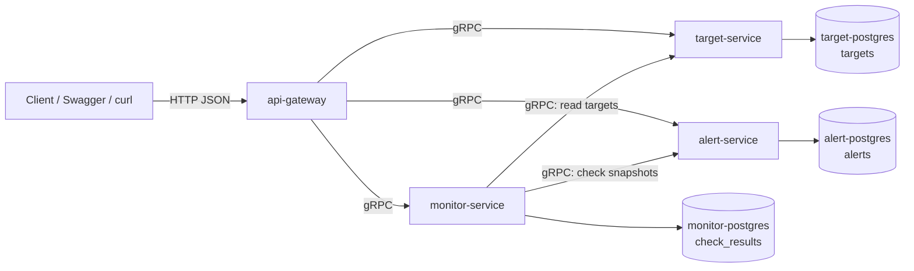
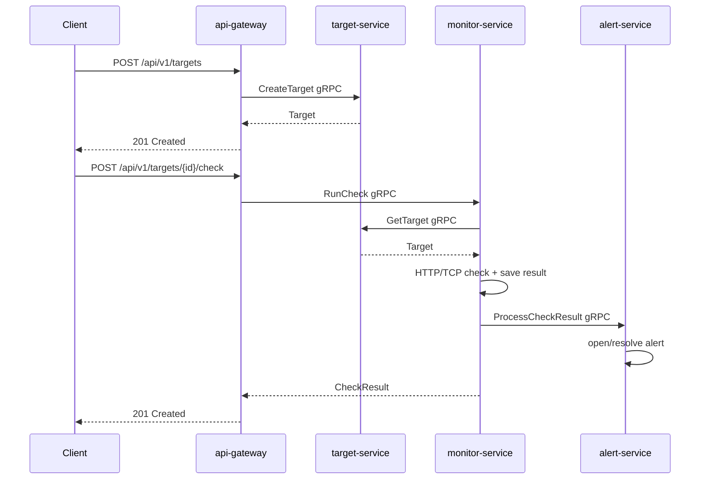

# NetWatch

NetWatch - платформа для мониторинга HTTP/TCP сервисов, написанная на
C++ и userver. Проект построен как микросервисная система: внешний HTTP API
отделен от доменных сервисов, каждый сервис владеет своей базой данных,
а внутреннее взаимодействие идет по gRPC.

## Стек

- C++ / userver;
- gRPC / Protocol Buffers;
- PostgreSQL;
- Docker / Docker Compose;
- CMake / Ninja;
- Swagger / OpenAPI;
- GitHub Actions.

## Что умеет NetWatch

- хранить HTTP и TCP targets
- запускать ручные проверки target через API
- выполнять периодические проверки active targets через scheduler
- сохранять историю check results
- возвращать текущий статус target
- создавать active alert при падении target
- закрывать alert при восстановлении target
- отдавать Swagger UI и OpenAPI contract
- собираться и проверяться через CI/CD

## Архитектура



Снаружи открыт только `api-gateway`. Остальные сервисы считаются внутренними и
доступны друг другу по gRPC внутри runtime-сети.

## Сервисы

| Service | Ответственность | Storage |
| --- | --- | --- |
| `api-gateway` | HTTP API, Swagger UI, OpenAPI, JSON/gRPC mapping | нет |
| `target-service` | target domain, CRUD, PATCH, validation | `target_service_db` |
| `monitor-service` | check runner, scheduler, check history, target status | `monitor_service_db` |
| `alert-service` | alert lifecycle, active/resolved alerts | `alert_service_db` |

### `api-gateway`

Единая публичная точка входа. Gateway принимает HTTP/JSON, вызывает внутренние
gRPC-сервисы и возвращает клиенту нормальные HTTP-ответы. Он не подключается к
PostgreSQL и не содержит доменных правил.

### `target-service`

Владелец target domain. Сервис хранит targets, валидирует HTTP/TCP параметры и
сам применяет PATCH к текущему состоянию target.

### `monitor-service`

Владелец check domain. Сервис получает targets через `target-service`, выполняет
HTTP/TCP проверки, сохраняет историю и возвращает последний статус target.
Scheduler периодически обходит active targets и запускает проверки без участия
внешнего клиента.

### `alert-service`

Владелец alert lifecycle. Сервис получает snapshot target и previous/current
check results, открывает `target_down` alert при падении и закрывает его после
восстановления.

## Границы владения в коде

```text
services/
  api-gateway/       public HTTP API, Swagger, OpenAPI, JSON mapping
  target-service/    target domain, validation, storage, gRPC service
  monitor-service/   check domain, runner, scheduler, storage, gRPC service
  alert-service/     alert domain, lifecycle, storage, gRPC service

libs/
  netwatch-proto/    generated gRPC code
  target-client/     typed gRPC client for target-service
  monitor-client/    typed gRPC client for monitor-service
  alert-client/      typed gRPC client for alert-service

proto/netwatch/      service contracts
tests/integration/   end-to-end gateway flow
docker/              production-like service image build
scripts/             local verification helpers
```

## Данные

У каждого сервиса отдельная PostgreSQL база:

- `target-service` владеет таблицей `targets`;
- `monitor-service` владеет таблицей `check_results`;
- `alert-service` владеет таблицей `alerts`.

Между базами нет shared tables, foreign keys и прямых SQL-запросов из чужого
сервиса. Связи между доменами проходят через gRPC contracts.

## Внутренние gRPC contracts

- `proto/netwatch/target_service.proto` - `TargetService`;
- `proto/netwatch/monitor_service.proto` - `CheckService`;
- `proto/netwatch/alert_service.proto` - `AlertService`.

Контракты версионируются через package names:

- `netwatch.target.v1`;
- `netwatch.monitor.v1`;
- `netwatch.alert.v1`.

`alert-service` принимает собственные snapshot messages, чтобы не зависеть от
внутренних моделей target/check сервисов.

## Основной runtime flow



## Public HTTP API

Локально `api-gateway` доступен на `http://localhost:8081`.

Документация:

- Swagger UI: `http://localhost:8081/docs`;
- OpenAPI JSON: `http://localhost:8081/openapi.json`;
- healthcheck: `http://localhost:8081/ping`.

Основные endpoint'ы:

- `POST /api/v1/targets`;
- `GET /api/v1/targets`;
- `GET /api/v1/targets/{id}`;
- `PATCH /api/v1/targets/{id}`;
- `DELETE /api/v1/targets/{id}`;
- `POST /api/v1/targets/{id}/check`;
- `GET /api/v1/targets/{id}/checks`;
- `GET /api/v1/targets/{id}/status`;
- `GET /api/v1/alerts`;
- `GET /api/v1/alerts/active`.

## Локальные адреса

| Component | Address |
| --- | --- |
| API Gateway | `http://localhost:8081` |
| Swagger UI | `http://localhost:8081/docs` |
| OpenAPI JSON | `http://localhost:8081/openapi.json` |
| Target service healthcheck | `http://localhost:8082/ping` |
| Target PostgreSQL | `localhost:15432` |
| Monitor PostgreSQL | `localhost:15434` |
| Alert PostgreSQL | `localhost:15435` |

Внутренние gRPC endpoints внутри Docker Compose:

- `target-service:8090`;
- `monitor-service:8091`;
- `alert-service:8092`.

## Быстрый запуск

```bash
docker compose up --build
```

После старта можно открыть Swagger UI:

```text
http://localhost:8081/docs
```

## Быстрая проверка

Собрать все сервисы:

```bash
./scripts/quick_check.sh build
```

Запустить end-to-end flow через `api-gateway`:

```bash
./tests/integration/run_api_gateway_flow.py
```

## CI/CD

GitHub Actions workflow собирает сервисы отдельно, запускает unit/integration
checks, собирает production-like Docker images и публикует их в GHCR.

Публикуемые images:

- `ghcr.io/<owner>/<repo>/api-gateway:<sha|branch>`;
- `ghcr.io/<owner>/<repo>/target-service:<sha|branch>`;
- `ghcr.io/<owner>/<repo>/monitor-service:<sha|branch>`;
- `ghcr.io/<owner>/<repo>/alert-service:<sha|branch>`.

